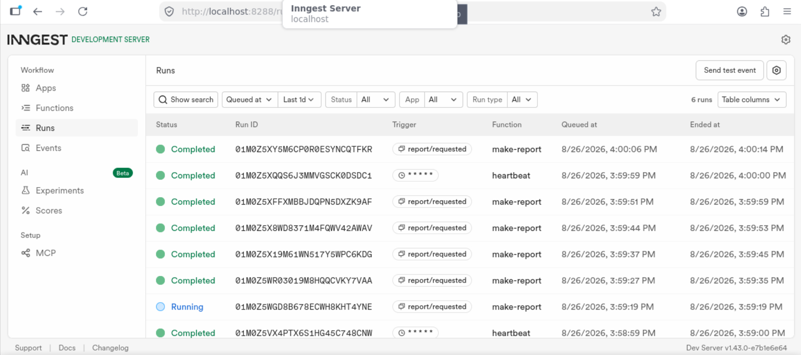

# Background Job Application

A FastAPI + Inngest demo: submit a report topic via the API, a background function picks it up, does fake slow work, and writes the result back to an in-memory store. A cron-triggered heartbeat summarises the report counts every minute.

---

## How to Run

You need [Python 3.10+](https://www.python.org/) with the packages installed (`pip install inngest fastapi uvicorn`) and [Node 18+](https://nodejs.org/) for the Inngest CLI.

**Terminal 1 — start the API**

```bash
INNGEST_DEV=1 python -m uvicorn main:app --port 8000
```

**Terminal 2 — start the Inngest Dev Server**

```bash
npx inngest-cli@latest dev -u http://localhost:8000/api/inngest
```

The API is at `http://localhost:8000` and the Dev Dashboard is at `http://localhost:8288`.

---

## Endpoints

| Method | Path | Description | Status |
|--------|------|-------------|--------|
| `GET` | `/health` | Health check | `200 { "status": "ok" }` |
| `POST` | `/reports` | Submit a report topic. Validates input (`topic` required), creates a pending report, sends `report/requested` event to Inngest, returns immediately. | `202 { "id": "1", "status": "pending" }` |
| `GET` | `/reports/{id}` | Get a report by ID. Shows `pending` while processing, then `done` with the result. | `200` or `404` |

---

## Inngest Functions

| Function | Trigger | Retries | Description |
|----------|---------|---------|-------------|
| `say-hello` | Event `test/hello` | default (3) | Sleeps 5 seconds, logs the event, returns a greeting. |
| `make-report` | Event `report/requested` | 2 | Sleeps 8 seconds (simulating slow work), then builds a report. If topic is `"fail"` it raises an error to exercise the retry mechanism. |
| `heartbeat` | Cron `* * * * *` | — | Fires every minute, logs how many reports are pending, done, and failed. |

---

## Proof

**POST** a report, then **GET** it twice — first while pending, then after the background function finishes:

```
$ curl -s -X POST http://localhost:8000/reports \
  -H "Content-Type: application/json" \
  -d '{"topic":"cats"}'

{"id":"1","status":"pending"}
```

First poll (immediately after — still processing):

```
$ curl -s http://localhost:8000/reports/1

{"id":"1","topic":"cats","status":"pending"}
```

Second poll (a few seconds later — done):

```
$ curl -s http://localhost:8000/reports/1

{"id":"1","topic":"cats","status":"done","result":"Generated report about 'cats'"}
```

---

## Dashboard



---

## Stage 3 and 4 answers

Stage 3:

Wrong input is an error caused by the user which should prompt them to retry their input. Wrong moment is an error caused by the server which should prompt it to retry to job. 

Stage 4:

Cron expression for everyday at 08:00 is 0 8 * * *

Cron expression for every sunday at 22:00 is 0 22 * * 0
