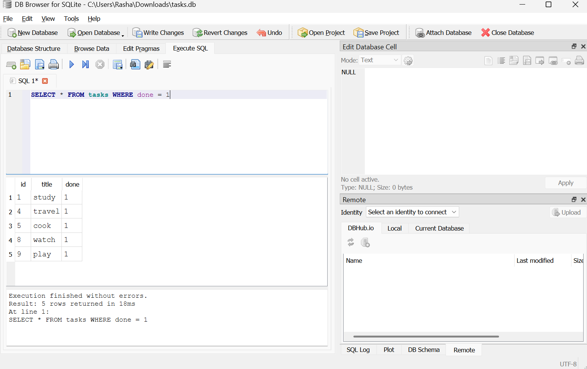

# Task API
 
A CRUD API for managing tasks, built with FastAPI and backed by a persistent SQLite database. Each task has an `id`, a `title`, and a `done` status. The API validates input, enforces basic business rules, and returns proper HTTP status codes for success and error cases.
 
## Data storage
 
Tasks are stored in a SQLite database rather than an in-memory list, so data survives server restarts. SQLite was chosen for this project because it's:
 
- **A single file** — no separate database server to install or run.
- **Zero setup** — Python's standard library talks to it directly via `sqlite3`, with no external service or configuration.
- **Persistent** — unlike an in-memory array, task data survives restarts of the API server.
The database lives in a single file, `tasks.db`, created automatically in the project directory the first time the server starts. It's excluded from version control via `.gitignore`, so each clone of this repository starts with a fresh database, seeded automatically with 3 example tasks on first run.
 
## Installation & Running
 
Install dependencies and start the development server with a single command:
 
```bash
pip install fastapi uvicorn && fastapi dev
```
 
By default, the server runs at `http://localhost:8000`, and `tasks.db` is created in the working directory on first startup if it doesn't already exist.
 
## Endpoints
 
| Method | Path          | Description                    | Success Status |
|--------|---------------|---------------------------------|-----------------|
| GET    | `/`           | Get a message describing the API | 200            |
| GET    | `/health`     | Check that the server is alive  | 200             |
| GET    | `/tasks`      | Get all tasks                   | 200             |
| GET    | `/tasks/{id}` | Get a single task by ID         | 200             |
| POST   | `/tasks`      | Create a new task               | 201             |
| PUT    | `/tasks/{id}` | Update a task by ID             | 200             |
| DELETE | `/tasks/{id}` | Delete a task by ID             | 204             |
 
### Validation & error handling
 
- `POST /tasks` requires a non-empty `title`; missing or empty titles return `400`.
- `PUT /tasks/{id}` requires a non-empty `title` and a valid boolean `done`; invalid input returns `400`, and a non-boolean `done` value is rejected automatically by FastAPI's own request validation with `422`.
- Requesting, updating, or deleting a task ID that doesn't exist returns `404`.
## Example: creating a task
 
```bash
curl -i -X POST http://localhost:8000/tasks \
  -H "Content-Type: application/json" \
  -d '{"title":"Buy milk"}'
```
 
Example response:
 
```
HTTP/1.1 201 Created
content-type: application/json
 
{"id":4,"title":"Buy milk","done":false}
```
 
## Interactive API docs (Swagger UI)
 
FastAPI automatically generates interactive documentation for every endpoint, available at:
 
```
http://localhost:8000/docs
```
 
This page lists all endpoints, their expected request bodies, and their possible responses, and lets you send test requests directly from the browser. Each endpoint's one-line docstring (e.g. `"Get all tasks."`) appears here as its description, making the page self-explanatory without needing to read the source code.
 

 
## Inspecting the database
 
Since tasks are stored in `tasks.db`, the data can also be viewed and queried directly using [DB Browser for SQLite](https://sqlitebrowser.org/), outside of the running API.
 

 
Example query — list only the tasks that are marked done:
 
```sql
SELECT * FROM tasks WHERE done = 1;
```
