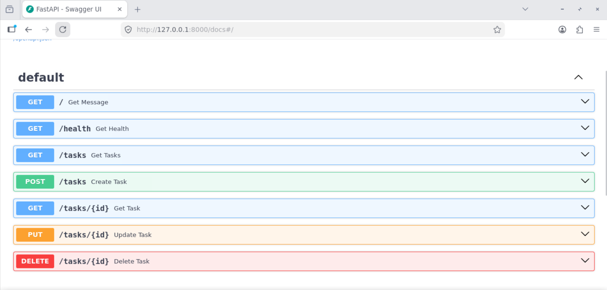
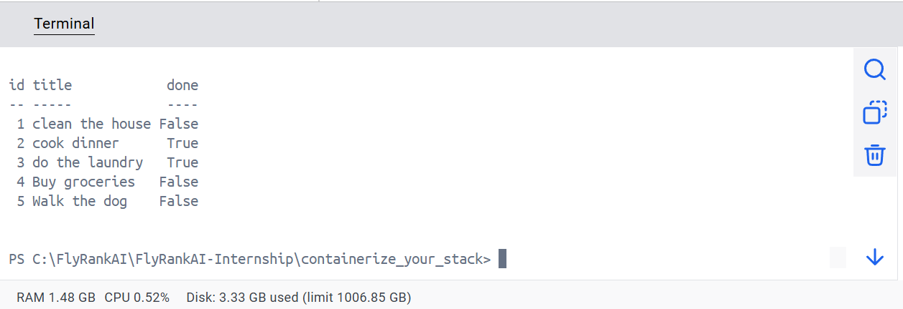

# Task API

A CRUD API for managing tasks, built with FastAPI and backed by a persistent PostgreSQL database, running entirely through Docker Compose. Each task has an `id`, a `title`, and a `done` status. The API validates input, enforces basic business rules, and returns proper HTTP status codes for success and error cases.

## Data storage

Tasks are stored in a PostgreSQL database running in its own container, connected to via `psycopg`. The API container and the database container run together, managed by Docker Compose, so there's no local database software to install.

## Installation & Running

1. Copy `.env.example` to `.env` and fill in the required values (database connection details used to build `DATABASE_URL`).
2. Start everything — the API and the database — with a single command:

```bash
docker compose up
```

The API is available at `http://localhost:8000` once both containers are up. On first startup, the API automatically creates the `tasks` table if it doesn't exist and seeds it with 3 example tasks if the table is empty.

## Environment variables

See `.env.example` for the full list of variables to set before running. At minimum, this includes the PostgreSQL credentials and connection details the API uses to construct `DATABASE_URL`.

## Endpoints

| Method | Path          | Description                    | Success Status |
|--------|---------------|---------------------------------|-----------------|
| GET    | `/`           | Get a message describing the API | 200            |
| GET    | `/health`     | Check that the server is alive  | 200             |
| GET    | `/tasks`      | Get all tasks                   | 200             |
| GET    | `/tasks/{id}` | Get a single task by ID         | 200             |
| POST   | `/tasks`      | Create a new task               | 201             |
| PUT    | `/tasks/{id}` | Update a task by ID             | 200             |
| DELETE | `/tasks/{id}` | Delete a task by ID             | 204             |

### Validation & error handling

- `POST /tasks` requires a non-empty `title`; missing or empty titles return `400`.
- `PUT /tasks/{id}` requires a non-empty `title` and a valid boolean `done`; invalid input returns `400`, and a non-boolean `done` value is rejected automatically by FastAPI's own request validation with `422`.
- Requesting, updating, or deleting a task ID that doesn't exist returns `404`.

## Example: creating a task

```bash
curl -i -X POST http://localhost:8000/tasks \
  -H "Content-Type: application/json" \
  -d '{"title":"Buy milk"}'
```

Example response:

```
HTTP/1.1 201 Created
content-type: application/json

{"id":4,"title":"Buy milk","done":false}
```

## Interactive API docs (Swagger UI)

FastAPI automatically generates interactive documentation for every endpoint, available at:

```
http://localhost:8000/docs
```

This page lists all endpoints, their expected request bodies, and their possible responses, and lets you send test requests directly from the browser. Each endpoint's one-line docstring (e.g. `"Get all tasks."`) appears here as its description, making the page self-explanatory without needing to read the source code.



## Inspecting the database

Task data can be viewed directly by connecting to the PostgreSQL container with any Postgres client.



Example query — list only the tasks that are marked done:

```sql
SELECT * FROM tasks WHERE done = true;
```