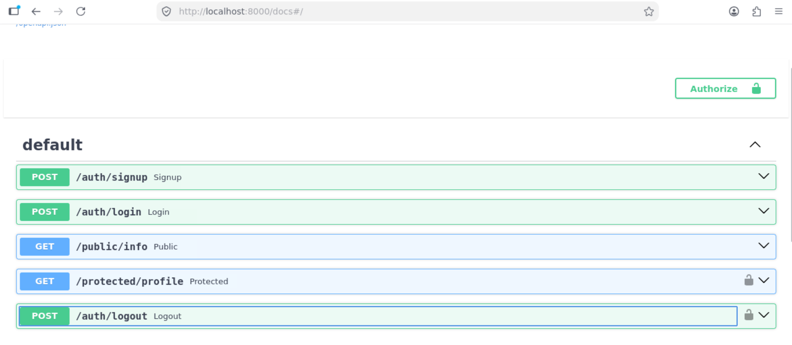

# FastAPI + Supabase Auth Service
 
A small FastAPI backend demonstrating user authentication with Supabase Auth. It supports user signup, login, logout, a public endpoint, and a token-protected endpoint, using a reusable FastAPI dependency to guard private routes.
 
## Setup
 
### 1. Install dependencies
 
```bash
pip install fastapi supabase python-dotenv "uvicorn[standard]"
```
 
### 2. Configure environment variables
 
Copy the example file and fill in your own Supabase project credentials:
 
```bash
cp .env.example .env
```
 
Then edit `.env` with the values from your Supabase project dashboard (**Project Settings > API**):
 
| Variable | Description |
|---|---|
| `SUPABASE_URL` | Your Supabase project URL |
| `SUPABASE_KEY` | Your Supabase anon/public API key |
 
### 3. Run the server
 
```bash
fastapi dev
```
 
The API will be available at `http://localhost:8000`, with interactive Swagger docs at `http://localhost:8000/docs`.
 
## API Reference
 
| Method | Endpoint | Description | Auth required |
|---|---|---|---|
| `POST` | `/auth/signup` | Register a new user | No |
| `POST` | `/auth/login` | Log in and receive an access/refresh token | No |
| `POST` | `/auth/logout` | Log out the current user | Yes (Bearer token) |
| `GET` | `/public/info` | Public informational endpoint | No |
| `GET` | `/protected/profile` | Return the authenticated user's profile | Yes (Bearer token) |
 
For protected endpoints, include the access token from `/auth/login` in the request header:
 
```
Authorization: Bearer <access_token>
```
 
## Swagger UI
 
