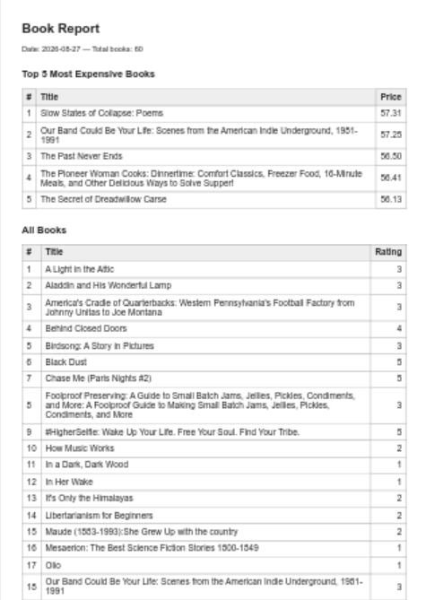

# PDF Report Generator

A small FastAPI service that aggregates a scraped book catalog into a summary report and renders it to a multi-page PDF with headless Chromium (via Playwright).

## What it is

`POST /reports` runs the whole pipeline in one request — query the database, build an HTML report, render it to `reports/<id>.pdf`, and record the row in `report.db`. The generated PDF contains:

- A title with the date of generation and the total number of books
- A table of the top 5 most expensive books
- A long table listing all books (its `<thead>` repeats on every page and rows never split across page breaks)

## Dataset

The program operates on `books.json` — 60 book records scraped from the Books to Scrape sandbox site (`books.toscrape.com`). Each record includes the title, price, star rating, and product URL. `seed.py` loads these into a `books` table in `report.db`.

## How to run

Use the project Python environment (`.venv`).

1. **Seed the database** — creates `report.db` and loads the books (safe to run repeatedly; it deletes all rows first, so it always leaves exactly one clean copy):

   ```bash
   python src/seed.py
   ```

2. **Start the API**:

   ```bash
   uvicorn src.main:app --port 8000
   ```

The server exposes:

| Endpoint | Description |
|----------|-------------|
| `GET /health` | Health check |
| `POST /reports` | Generate a report (once per day; send `{"force": true}` to override) |
| `GET /reports/{id}` | Report row metadata including its file link |
| `GET /reports/{id}/file` | Download the PDF |

## Aggregation SQL

The report is built from these queries (see `src/report_data.py`):

```sql
-- total number of books
SELECT COUNT(*) FROM books;

-- average price
SELECT AVG(price) FROM books;

-- top 5 most expensive books
SELECT title, price FROM books ORDER BY price DESC LIMIT 5;

-- number of books per star rating
SELECT rating, COUNT(*) FROM books GROUP BY rating ORDER BY rating;
```

Example output for the `books.json` dataset:

```json
{
  "total_books": 60,
  "average_price": 35.00266666666666,
  "top_5_most_expensive": [
    {"title": "Slow States of Collapse: Poems", "price": 57.31},
    {"title": "Our Band Could Be Your Life: Scenes from the American Indie Underground, 1981-1991", "price": 57.25},
    {"title": "The Past Never Ends", "price": 56.5},
    {"title": "The Pioneer Woman Cooks: Dinnertime: Comfort Classics, Freezer Food, 16-Minute Meals, and Other Delicious Ways to Solve Supper!", "price": 56.41},
    {"title": "The Secret of Dreadwillow Carse", "price": 56.13}
  ],
  "books_per_rating": {
    "1": 15,
    "2": 8,
    "3": 13,
    "4": 10,
    "5": 14
  }
}
```

## POST → download proof

Generate a report, then download it as a PDF:

```bash
# Reports are cached once per day, so use --force to make a fresh copy
curl -i -X POST -H "Content-Type: application/json" -d '{"force": true}' http://localhost:8000/reports
# -> HTTP/1.1 201 Created
# -> {"id": 1, "file": "/reports/1/file"}

curl -o my-report.pdf http://localhost:8000/reports/1/file
# -> downloads a valid PDF (open it to confirm)
```



## Notes

- `report.db` and the `reports/` directory are gitignored. Drop your own data into `books.json` and re-run `python src/seed.py` to work with your own dataset.

## Stage 4 and 5 Answers

Stage 4:

I would move the long work of generating a whole report in the endpoint itself when I expect the report to be larger than 10 MB.

Stage 5:

The check prevents duplicate expensive work when a user (or an impatient client) submits the same request repeatedly.

One real world example where not having the check costs a lot is a monthly invoice endpoint where if a user clicks on "generate" many times, storage will be wasted and computing power will be wasted on workers doing the same job over and over.
